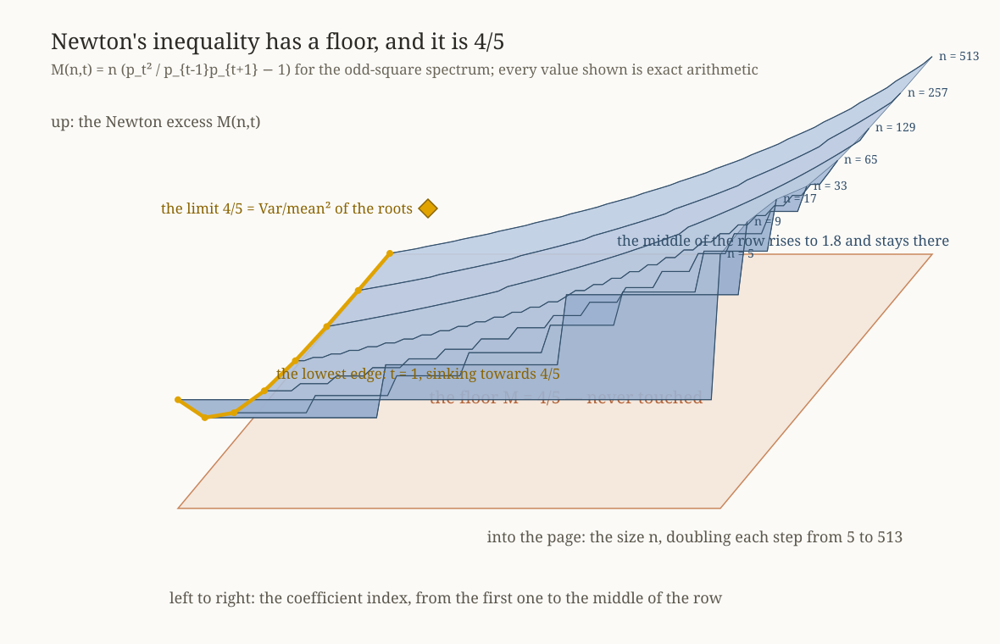
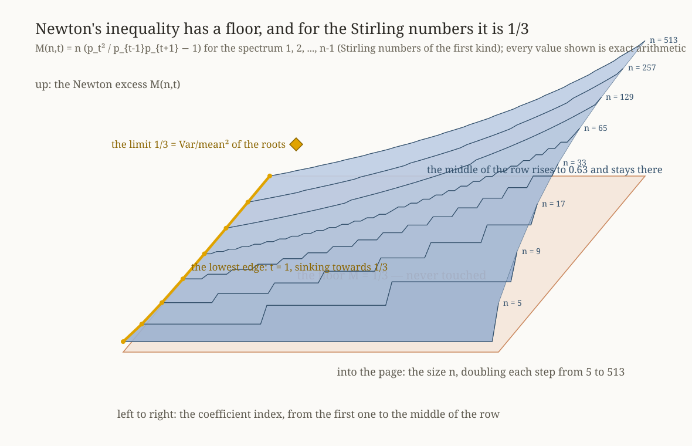

# A floor under Newton's inequality

**Andrei Pluzhnik** — ORCID [0009-0005-5660-2603](https://orcid.org/0009-0005-5660-2603)

Newton proved in 1707 that the normalised coefficients of a real-rooted polynomial are log-concave:
`p_t² ≥ p_{t-1} p_{t+1}`. This repository proves that for two classical families the inequality holds with a
**definite margin**, and identifies that margin exactly.



---

## The two results

Write `p_j = e_j / C(N, j)` for the normalised coefficients of a polynomial with `N` positive roots, `n = N+1`,
and `M(n,t) = n (p_t²/(p_{t-1}p_{t+1}) − 1)` for the **Newton excess**.

**Theorem A (complete).** For the centred-square spectrum `{(n−2k)² : k = 1..n−1}` — the odd squares, each twice —

```
M(n,t) > 4/5      for every odd n ≥ 5 and every t < n/2.
```

The constant is sharp: `M(n,1)` decreases to `4/5` and never reaches it. `4/5` is the relative variance
`Var(b)/E(b)²` of the roots in the limit; for the family `b_k = k^p` the corresponding constant is `p²/(2p+1)`.

**Theorem B (Sibuya's 1988 conjecture, large parts).** For the unsigned Stirling numbers of the first kind
(`b_k = k`, `k = 1..n−1`), Sibuya conjectured — and did not prove — that

```
p_j²/(p_{j-1}p_{j+1}) ≥ 1 + 1/(3n − j),      with equality at j = 1.
```

Proved here: for every `j ≤ 1000` and every `n`; for every `j ≥ 1001` with `j/(n−1) ≤ 0.9`; and, at the top of
the row, for every `n` and every `j` with at most 802 indices missing. The one region still open — `j ≥ 1001`
with `j/(n−1) > 0.9` and at least 803 indices missing — is stated exactly in [ARTICLE.md](ARTICLE.md), section 7,
and in [`../OBSTRUCTION.md`](../OBSTRUCTION.md).



## How to read the pictures

The surface is the excess, computed exactly. Left to right runs the coefficient index, from the first one to the
middle of the row; into the page runs the size `n`, doubling each step; up is the excess. The flat plane is the
floor the theorem forbids it to cross. The yellow path is the lowest edge of the surface — the first index — and
the diamond marks the limit it approaches without touching: `4/5` for the odd squares, `1/3` for the Stirling
numbers. Both are the relative variance of the roots.

## Reproducing

```
uv sync
uv run python projects/qg-bootstrap/release/scripts/theorem.py --full          # Theorem A, three certificates, ~7 min
uv run python projects/qg-bootstrap/release/scripts/sibuya_theorem.py --full    # Theorem B, four certificates, ~14 min
uv run python projects/qg-bootstrap/release/scripts/sibuya_harmonic.py 33       # the top of the row, ~5 min
uv run python projects/qg-bootstrap/release/scripts/sibuya_corner_grid.py 802   # the window of 33..802 missing indices, ~80 min
uv run python projects/qg-bootstrap/release/scripts/fig3d_theorem.py            # the figures
uv run python projects/qg-bootstrap/release/scripts/fig3d_sibuya.py
```

Everything that decides a claim is exact rational (`python-flint`'s `fmpq`, `fmpq_poly`, `fmpz_poly`) or
certified interval arithmetic (`arb`, `acb`); floating point appears only in printing and in the adaptive choice
of box and step sizes, never in a comparison a conclusion rests on. Each run writes a log under
[`../results/`](../results/); the logs quoted in the article are in the repository.

## What is in here

| file | what it is |
|---|---|
| [ARTICLE.md](ARTICLE.md) | the paper: both statements, the shared instrument, the pieces, what is proved and what is not |
| [PAPER.md](PAPER.md) | the working notebook the article was distilled from, including refuted routes |
| [LIMITATIONS.md](LIMITATIONS.md) | what separates the present state from a referee's "proved" |
| [OUTREACH.md](OUTREACH.md) | who to write to, with verified affiliations, and the arXiv endorsement rules as of 2026 |
| [PUBLISH.md](PUBLISH.md) | the exact steps to put this on GitHub and Zenodo |
| `scripts/` | every certificate, the assemblies, and the figure generators. `sibuya_top_w.py` is the instrument for the one open region and exits 1 at its cusp; it is not a certificate |
| `data/` | the figures |
| [`../results/`](../results/) | logs of every run, the independent validation reports, and the literature verdicts |

## Independent validation

Each certificate was re-derived and re-run by an independent agent that did not import the code it validated;
the reports are in `../results/VALIDATION_*.md`. Four defects found there (a missing term in a `1/M_0` bound, a
non-analytic base object, a non-`σ`-free tail, a multiplier off by a factor 2) were fixed and the scripts re-run.
The word *proved* is used only for statements that a script re-establishes on demand.

## Method, in one paragraph

The excess is written as `g = −Δ² log p_t` and given two exact representations: a **sampling expansion** of the
elementary symmetric functions, used when the index is small compared with `√N`, and the **second cumulant of an
exactly tilted Fourier weight**, used otherwise. The tilted cumulants have closed forms (polygamma at complex
argument for the odd squares, `k_1 = N − x[ψ(N+1+x) − ψ(1+x)]` for `1..N`), the Edgeworth expansion is an exact
polynomial derived on weight-truncated rational dictionaries, and every error term is an explicit interval —
never an `O(·)`. Three devices keep the intervals alive: a variance identity that removes a `1/θ` cancellation,
a two-pass mean-value enclosure in the tilt, and, at the degenerate corner, an exact power series in which every
divergent term cancels symbolically.

## Licence and citation

MIT (see `../../../LICENSE`). If you use this, please cite the DOI of the Zenodo record for this release
(added on publication) and the ORCID above.

## AI disclosure

The proofs were constructed and the code written in collaboration with an AI assistant, under the author's
direction; see [AI_DISCLOSURE.md](AI_DISCLOSURE.md). Every certificate is machine-checked and every claim in the
article points at a logged run.

---

## About this lab, honestly

This is an independent, AI-assisted lab: one person, an AI agent, and a hard house rule that the agent never
gets to mark its own work as verified. Every claim above passed deterministic gates, an independent
re-implementation, and two adversarial reviews whose reports ship in `results/` — including the one that found
a real mistake in a derivation on the day of release, and the repair. We are not a university group and do
not pretend to be one; we are trying to do careful work and to join a conversation that has been going on
since 1707. If you find an error, we would genuinely like to hear it, and it will be fixed and logged in
public. Full disclosure of what the AI did and did not do: [`AI_DISCLOSURE.md`](AI_DISCLOSURE.md).
